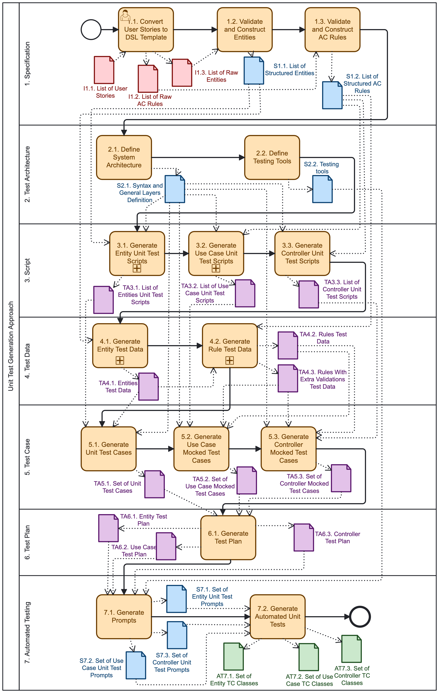

# Req2Test Tool

**Req2Test Tool** is a research prototype that automatically generates **unit tests** from **user stories** using a **domain-specific language (DSL)** and **Large Language Models (LLMs)**.

The **automated testing** are generated using a **DSL** specifically developed for this research. Its generation depends on earlier stages, including:
- creation of **test scripts**
- definition of **test data**
- generation of **test cases**
- generation of **test plan**

The pipeline processes these stages sequentially and outputs executable unit test classes and supporting artifacts.

---

##  Implementation

The Req2Test Tool was implemented in **Kotlin** using a **pipes-and-filters** architecture. The implementation focuses on generating unit test cases for a Java-based architecture (entities, use cases, controllers/endpoints) and targets high unit test coverage for **Spring Boot** RESTful APIs. Generated tests rely on common testing frameworks and tools such as **JUnit 5**, **MockMvc**, and **Mockito**.

---

##  Important: ChatGPT Token (required)

Before running the tool you **must** add your ChatGPT API token. Edit:

```
req2test/tool/approach/core/APIKeys.kt
```

and set the token in the static attribute `ChatGPT`. Example Kotlin `APIKeys.kt`:

```kotlin
package req2test.tool.approach.core

class APIKeys {
  companion object {
    val ChatGPT = "chatgpt-api-key"
  }
}
```

---

##  What the tool generates

When you run a project under `req2test/tool/approach/projects/` (for example `req2test/tool/approach/projects/project1.kt`), the tool generates artifacts under `OutputArtifacts/`. The generated artifacts include:

- **prompts/** — the prompts produced/used for LLM calls (for reproducibility)
- **test-classes/** — generated unit test classes
    - Controller (endpoint) tests (using mocks, suitable for MockMvc + Mockito)
    - UseCase tests (using mocks)
    - Entity tests
- **support-artifacts** — auxiliary files produced during generation (test data json, test script, test case)

These test classes are configured as unit tests (JUnit 5) and are intended to be used as a starting point / baseline for automated test suites.

---

##  Requirements

- **JDK** ≥ 17
- Kotlin (configured via Gradle)

## Approach (BPMN)


